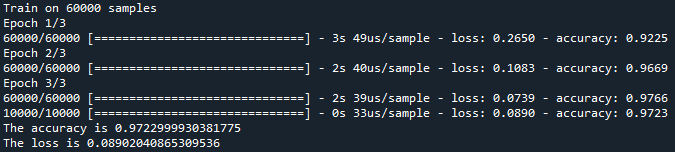
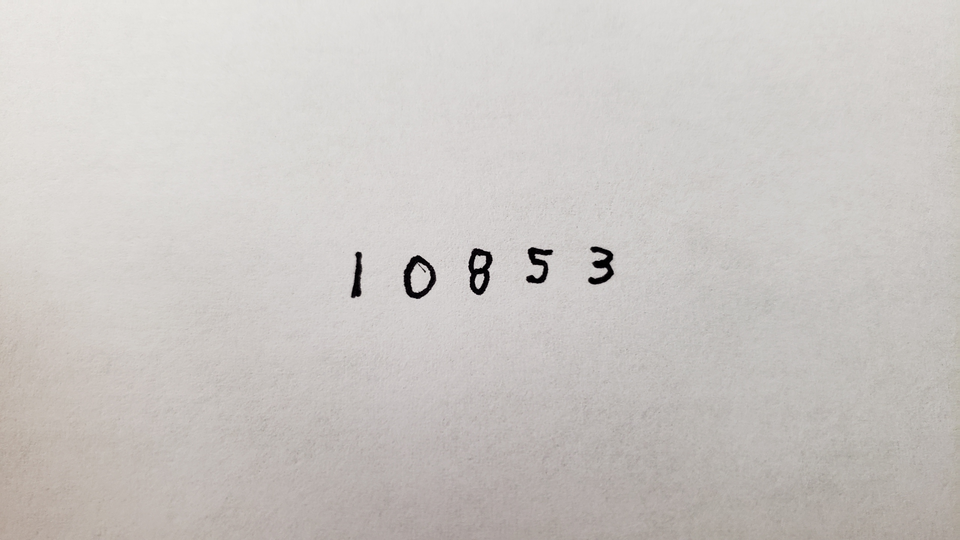
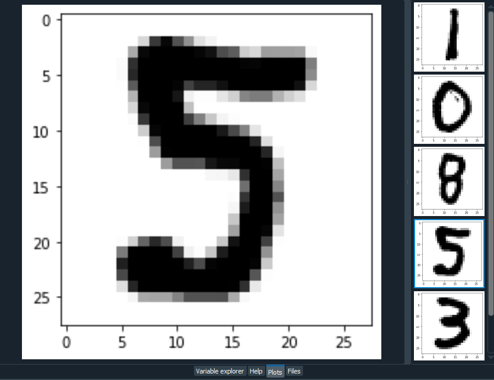
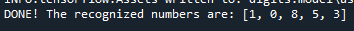
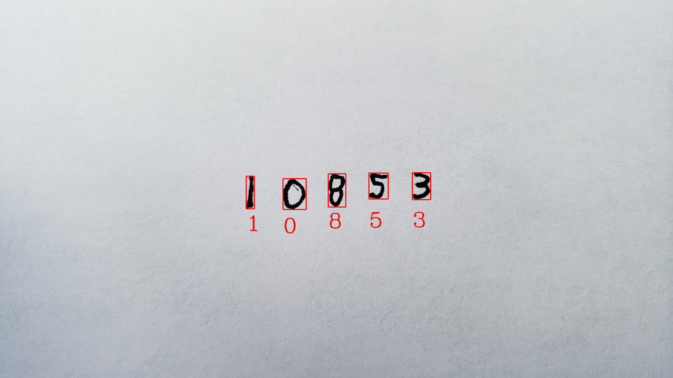

# Handwritten-Digit-Classifier
Small application written in Python. Uses OpenCV and Tensorflow to train and test a neural network to recognize handwritten digits.

The neural network is created and trained with the MNIST dataset. It has 60,000 samples, which will help the model become very accurate. Testing the model results in an accuracy rate of over 95% most of the time.

Here is the original sample image that the model uses to predict the digits of once it's trained.

After preprocessing the sample image, the code is able to use OpenCV to break apart each individual contour within the image.

Every individual digit contour is converted into a 28x28 square image and fed into the neural network model to make a prediction.

The predicted numbers along with their corresponding bounding boxes are also drawn on the original image and saved to the folder.

